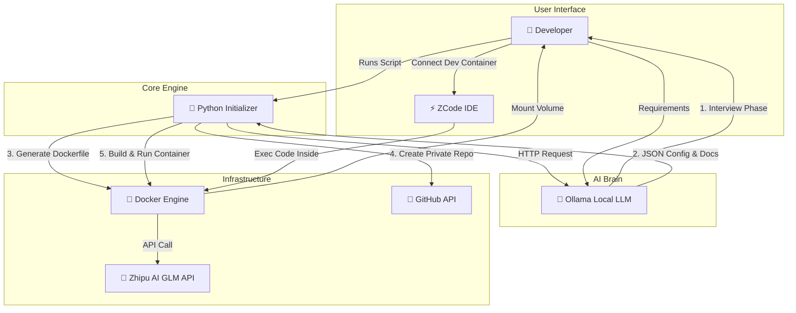

# 🌊 Vibe Coding Initializer
### AI-Powered Project Scaffolding for Zhipu AI GLM

**Transform a conversation with Local AI into a fully containerized, cloud-synced development environment.**

[](https://www.python.org/)
[](https://www.docker.com/)
[](https://ollama.com/)
[](https://open.bigmodel.cn/)

</div>

---

## 📖 Overview

**Vibe Coding Initializer** is a sophisticated Python automation tool designed to eliminate the friction of starting new software projects. It leverages **Ollama** (running locally) to act as an expert Technical Product Manager, conducting a detailed interview to define your requirements.

It is specifically architected for the **ZCode** environment and optimized for developing applications powered by **Zhipu AI (Z.AI)** GLM models.

### ✨ Why This Is Helpful

1.  **Zero-Configuration Start**: Stop manually creating `Dockerfiles`, `.gitignore`, and folder structures. The AI generates them based on your specific needs.
2.  **Intelligent Architecture**: The tool doesn't just ask "What language?"; it asks about platform targets, data persistence, scaling needs, and documentation requirements.
3.  **Zhipu AI Integration**: The generated Docker containers come pre-configured with the `zhipuai` SDK and environment placeholders, allowing you to call GLM models immediately.
4.  **Automated Documentation**: Generates a detailed `tasks.md` roadmap and `skills.md` tech stack document before you write a single line of code.
5.  **Seamless Git Sync**: Automatically creates a **private GitHub repository** and pushes your initial commit, ensuring your "vibe coding" session is backed up instantly.

---

## 🏗️ System Architecture

This tool orchestrates local LLM reasoning, filesystem operations, and Docker containerization to create a unified workflow.



---

## 🛠️ Prerequisites

Before running the initializer, ensure your environment is fully set up:

1.  **Python 3.10+**: Required to run the script.
2.  **Docker Desktop**: Must be installed and running.
3.  **Ollama**: Running locally with a model pulled.
    ```bash
    # Install Ollama (Linux/Mac)
    curl -fsSL https://ollama.com/install.sh | sh
    
    # Pull a capable model (e.g., Llama3 or Mistral)
    ollama pull llama3
    ```
4.  **GitHub CLI (`gh`)**: Authenticated with `write:repo` scope.
    ```bash
    # Login to GitHub
    gh auth login
    ```

---

## 🚀 Installation & Usage

### Step 1: Get the Script
Download the `vibe_init.py` script to a dedicated tools folder.

### Step 2: Install Dependencies
The script requires the `requests` library to communicate with the Ollama API.
```bash
pip install requests
```

### Step 3: Run the Initializer
Execute the script from your terminal.
```bash
python vibe_init.py
```

### Step 4: The Interview
The Local AI will begin a conversation.
> **AI**: "Hello, I am your Technical Architect. What are we building today?"
> **You**: "I want to build a financial SaaS dashboard using Python."
> **AI**: "Understood. Will this require real-time data? What database do you prefer (Postgres/Mongo)? Is this for internal use or external clients?"
> ...
> **You**: "Generate configuration."

### Step 5: Start Coding
Once the script finishes:
1.  Open **ZCode** (VS Code).
2.  Open the folder created in `Documents/VibeCode/`.
3.  Use the **"Dev Containers: Attach to Running Container..."** command.
4.  Select the Docker container created by the script.

---

## 📁 Output Structure

The tool generates a standardized project structure inside `Documents/VibeCode/[project-slug]/`:

```text
project-slug/
├── 📄 Dockerfile         # Custom-built environment (Python/Node/Go)
├── 📄 README.md          # Auto-generated documentation
├── 📄 tasks.md           # Development roadmap based on interview
├── 📄 skills.md          # Tech stack and requirements
├── 📄 main.py            # Boilerplate code with Zhipu SDK ready
├── 📄 .gitignore         # Standard ignores
└── 📁 .git/              # Initialized Git repository
```

---

## 🤖 Zhipu AI GLM Integration

This environment is tailored for developing with Zhipu AI's GLM models.

-   **SDK Ready**: The container comes with `pip install zhipuai` pre-installed.
-   **Environment Handling**: The script securely prompts for your API Key and passes it to the container as an environment variable.
-   **Usage in Code**:
    ```python
    import os
    from zhipuai import ZhipuAI

    # The environment variable is pre-set by the initializer
    client = ZhipuAI(api_key=os.environ.get("ZHIPUAI_API_KEY"))

    response = client.chat.completions.create(
        model="glm-4",
        messages=[
            {"role": "user", "content": "Start the vibe coding session."}
        ],
    )
    print(response.choices[0].message.content)
    ```

---

## 📄 License

This project is open-source and available under the MIT License.
